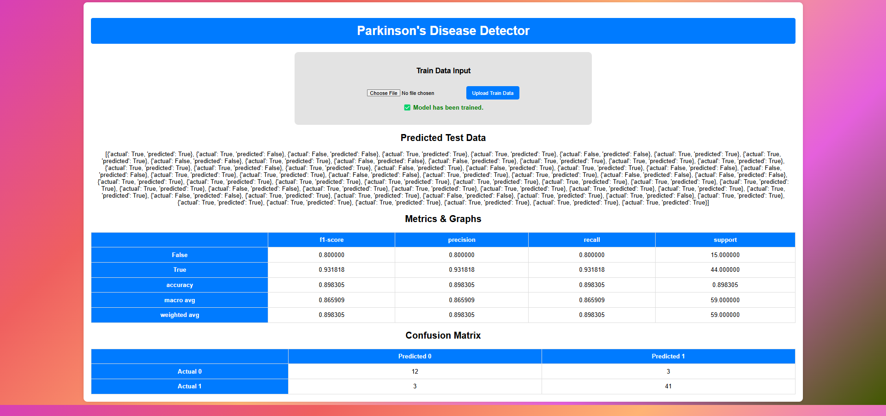
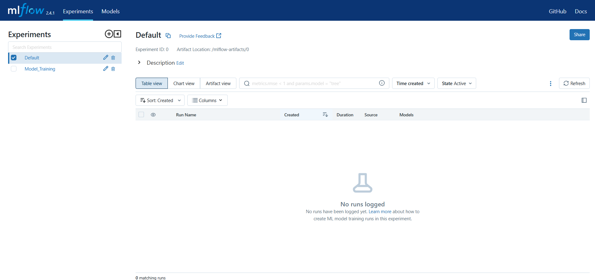

# team50
### A Nanyang Polytechnic 24S2-EGT309 AI SOLUTION DEVELOPMENT PROJECT made in 2025. 

## Tree Directory
```bash
.
├── LICENSE
├── README.md
├── application
│   ├── Dockerfile
│   ├── application.yaml
│   ├── flask
│   │   ├── app.py
│   │   └── templates
│   │       └── index.html
│   └── requirements.txt
├── data
├── deploy.sh
├── images
│   ├── Ml-flow.png
│   └── app-service.png
├── inference
│   ├── dockerfile
│   ├── inference.py
│   ├── inference.yaml
│   └── requirements.txt
├── mlflow-pvc.yaml
├── mlflow.yaml
├── model
│   ├── Dockerfile
│   ├── model.py
│   ├── model.yaml
│   └── requirements.txt
├── model-pvc.yaml
├── processing
│   ├── Dockerfile
│   ├── processing.py
│   ├── processing.yaml
│   └── requirements.txt
├── shared-pv.yaml
└── shared-pvc.yaml
```

## Deployment Instructions

To deploy the services in a Minikube environment, follow these steps:

1. Run the deployment script:
   ```sh
   ./deploy.sh
   ```
2. Check the status of the pods
    ```sh
    kubectl get pods
    ```
3. If all the pods are RUNNING
    
    Retrieve the service URLs:
    - Application Service:
        ```sh
        minikube service application-service --url
        ```

        
    - MLflow Service (OPEN IN A NEW WSL TERMINAL): 
        ```sh
        minikube service mlflow-service --url
        ```       

        

These commands will deploy the application and provide URLs to access the services.


## Application Service

This application provides a web interface for processing data, training a model, and displaying results for Parkinson's disease detection. It is containerized and deployed with Kubernetes.

### Features

- *Web Interface*: Allows users to upload training data and view results.
- *Automated Workflow*:
  - Upload triggers data processing.
  - Training starts automatically after processing.
  - Results are fetched from the inference service.
- *Results Display*: Shows predictions, evaluation metrics, and confusion matrix.
- *Error Handling*: Validates file formats and checks for processing failures.

### Deployment

- *Kubernetes Deployment*: Supports rolling updates with maxUnavailable=1 and maxSurge=1.
- *Replica Management*: Runs with 3 replicas for high availability.
- *Persistent Volume*: Uses a shared Persistent Volume Claim (PVC) for storing uploaded data.
- *Containerized*: Runs as a Docker container (application:latest).
- *Service Exposure*: Exposed via a Kubernetes NodePort service on port 5000.

### Usage

- *Web Interface*: Available at http://<host>:5000
  - *Upload Training Data*: Starts processing and training automatically.
  - *View Results*: Displays evaluation metrics and predictions.

This service provides an end-to-end workflow for training and evaluating a Parkinson's disease detection model.


## Processing Service

This service is responsible for data preprocessing, including cleaning, imputing missing values, and splitting datasets for model training. It is containerized and deployed with Kubernetes.

### Features

- *Data Cleaning*: Removes duplicates and unnecessary columns.
- *Missing Value Imputation*: Uses K-Nearest Neighbors Imputer (KNNImputer) for handling missing values.
- *Dataset Splitting*: Performs stratified train-test splitting (70-30 split).
- *Automated Processing*: Detects and processes training or test data automatically.
- *Processed Data Storage*: Saves preprocessed datasets for further use.

### Deployment

- *Kubernetes Deployment*: Supports rolling updates with maxUnavailable=1 and maxSurge=1.
- *Replica Management*: Runs with 3 replicas for reliability and scalability.
- *Persistent Volume*: Uses a shared Persistent Volume Claim (PVC) for data storage.
- *Containerized*: Runs as a Docker container (processing:latest).
- *Service Exposure*: Exposed via a Kubernetes NodePort service on port 5001.

### Usage

- *Processing Endpoint*: POST /process
  - Detects and processes available training (raw_train.csv) or test (raw_test.csv) data.
  - Saves preprocessed datasets to /data directory.

This service ensures that data is properly cleaned and prepared before model training.

## Model Service

This service trains a machine learning model using provided datasets and logs performance metrics. It is containerized and deployed with Kubernetes.

### Features

- *Automated Training*: Trains a RandomForestClassifier on uploaded data.
- *Performance Metrics*: Computes accuracy, F1-score, error rate, and ROC-AUC.
- *Model Evaluation Artifacts*:
  - Saves and logs confusion matrix, ROC curve, and decision tree visualization.
- *MLflow Integration*: Logs parameters, metrics, and artifacts for tracking.
- *Persistent Model Storage*: Saves trained models for inference.

### Deployment

- *Kubernetes Deployment*: Supports rolling updates with maxUnavailable=1 and maxSurge=1.
- *Replica Management*: Runs with 3 replicas for scalability and reliability.
- *Persistent Volume*:
  - Uses a shared PVC for training data.
  - Uses a dedicated PVC (model-pvc) for storing trained models.
- *Containerized*: Runs as a Docker container (model:latest).
- *Service Exposure*: Exposed via a Kubernetes NodePort service on port 5002.

### Usage

- *Training Endpoint*: POST /train
  - Loads training data (x_train.csv, y_train.csv).
  - Trains a model and saves it to persistent storage.
  - Logs metrics and artifacts in MLflow.

This service ensures efficient model training and evaluation for deployment in machine learning pipelines.

## Inference Service

This service performs model inference and evaluation, generating classification metrics and predictions. It is containerized and deployed with Kubernetes.

### Features

- *Model Evaluation*: Computes classification metrics and confusion matrix.
- *Prediction Generation*: Runs inference on test data and outputs predictions.
- *Automated Processing*: Automatically detects available trained models and test datasets.
- *Error Handling*: Checks for missing models or data before execution.
- *Result Output*: Returns evaluation results as JSON.

### Deployment

- *Kubernetes Deployment*: Supports rolling updates with maxUnavailable=1 and maxSurge=1.
- *Replica Management*: Runs with 3 replicas for scalability and fault tolerance.
- *Persistent Volume*:
  - Uses a shared Persistent Volume Claim (PVC) for test data.
  - Uses a dedicated PVC (model-pvc) for storing trained models.
- *Containerized*: Runs as a Docker container (inference:latest).
- *Service Exposure*: Exposed via a Kubernetes NodePort service on port 5003.

### Usage

- *Evaluation Endpoint*: GET /evaluate
  - Loads the trained model and test data.
  - Computes predictions, classification metrics, and confusion matrix.
  - Returns results in JSON format.

This service enables model inference and evaluation for real-time analysis.

## Kubernetes Configurations

These YAML files define the Kubernetes deployment and storage configurations for the machine learning pipeline, including model training, inference, and MLflow tracking.

### Features

- *Persistent Volume (PV) & Claims (PVCs)*:
  - shared-pv.yaml: 5Gi shared Persistent Volume (ReadWriteMany) for storing data.
  - shared-pvc.yaml: 1Gi Persistent Volume Claim for accessing shared storage.
  - model-pvc.yaml: 1Gi PVC dedicated to storing trained models.
  - mlflow-pvc.yaml: 2Gi PVC for storing MLflow artifacts.

- *MLflow Tracking*:
  - mlflow.yaml: Deploys MLflow as a service.
  - Uses an SQLite backend (mlflow.db) for logging experiments.
  - Stores artifacts in /mlflow-artifacts.
  - Exposes MLflow UI on port 5004 via a Kubernetes NodePort.

- *Scalability & Availability*:
  - MLflow runs with 1 replica (mlflow.yaml).
  - Shared storage supports ReadWriteMany for concurrent access.
  - PVCs ensure data persistence across pod restarts.

### Deployment

- *Storage*: Persistent Volumes (shared-pv.yaml) and Claims (shared-pvc.yaml, model-pvc.yaml, mlflow-pvc.yaml) ensure reliable data management.
- *Service Exposure*: MLflow is accessible via a NodePort service on port 5004.

These configurations provide scalable storage and logging for machine learning workflows in Kubernetes.